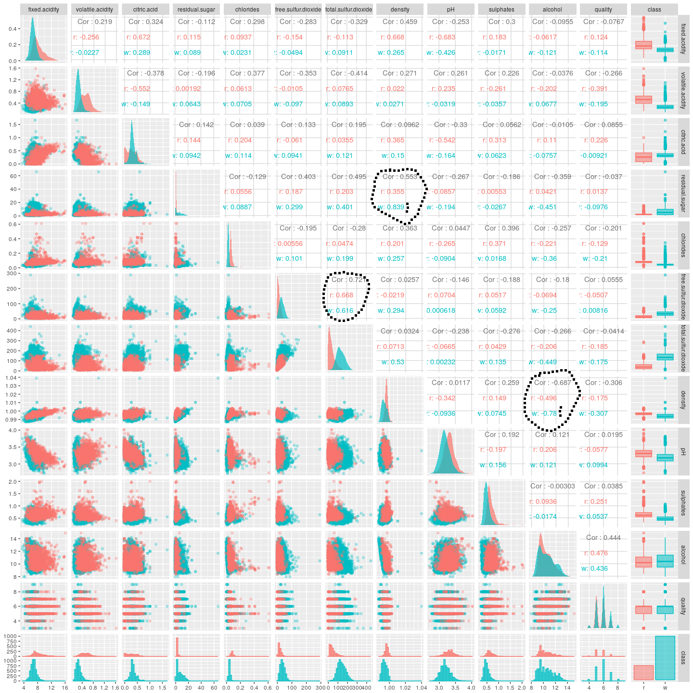

# Aim
The Aim of this document is to build a model to classify red and white wine by using a 
a dataset which was merged out of two separate ones. This is for my own learning purpose and to 
recap learned methods.

The success will be measured with the accuracy in correctly classifying types of wine in an unseen 
test dataset.

We will try to achiev this goal by trying differnet types of models and methods for variable 
selection.

# Load packages and data

At first we need to load the required packages...
```{r}
require(tidyverse, quietly = T) # for data manipulating and visualisation
require(GGally, quietly = T)# for ggpairs plot
require(caret, quietly = T) # for doing k-fold cross validation model training
require(bestglm) # for best subset selection
require(rpart) # for decision tree 
require(randomForest) # for random forest
```

After that we will load the dataset into our workspace:
```{r}
wines0 <- readRDS("./data/wineQualityCombined.RDS")
```

The original dataset has a `quality` variable which can be used for training purpose on regression
problems. Since we only want to start with classifying red- vs. white wine, we will remove this 
variable from the data.

```{r}
wines <- wines0 %>% 
  select(-quality) 
```


# Data overview
At first we will use `ggpairs`to compare the variables in the dataset
```{r, fig.height=15, fig.width=15, include = FALSE}
my_diag <- function(data, mapping, ...) {
  ggplot(data = data, mapping=mapping) +
    geom_density(..., alpha = 0.7, color = NA) 
}

my_lower <- function(data, mapping, ...) {
  ggplot(data = data, mapping=mapping) +
    geom_point(..., alpha = 0.3) 
}

wines %>% 
  ggpairs(mapping = aes(fill = class, color = class, alpha = 0.3),
          diag = list(continuous = my_diag), lower = list(continuous = my_lower))
```

     

There is only correlation bewteen:  

* density and alcohol  
* density and residual.sugar  
* total.sulfur.dioxid and free.sulfur.dioxid  

Further the overview plot shows us that there are some variables which seem to be
appropriate to distinguish between red and white wine.
When looking at their distribution some favorites are:  

* volatile.acidity
* residual sugar
* chlorides
* total.sulfur.dioxide

Let's see if we will find them later beeing selected in our variable choosing methods.


# Feature Engineering

In order to give our prediction models more "insights" we will try to engineer some features

# Dry, Medium dry, Medium, Sweet (only depending on sugar level)

Since we have the `residual.sugar`concentration we are able to classify the wines by product type.
(Quelle hinzufügen)

But at first let's have a look at our `residual.sugar` variable and its distribution within the 
classes:
```{r}
wines %>% 
  ggplot() +
  geom_histogram(aes(x = residual.sugar, fill = class), binwidth = 0.5)
```

We can see that red wine does not have many residual sugar values above 10 while white wine has.
Let's introduce our new `product.type` variable:

```{r}
wines <- wines %>% 
  mutate(product.type = factor(ifelse(residual.sugar < 4, 
                               "dry",
                               ifelse(residual.sugar < 12, 
                                      "medium dry",
                                      ifelse(residual.sugar < 45,
                                             "medium",
                                             "sweet")))))
 
```

Taking into account our new variable the distribution looks as follows:

```{r}
table(wines$product.type, wines$class)
```

We can also visualize that:
```{r}
wines %>% 
  ggplot() +
  geom_bar(aes(x = product.type, fill = class), position = position_fill()) +
  ggtitle("Share of wine class within product type")

wines %>% 
  ggplot() +
  geom_bar(aes(x = class, fill = product.type), position = position_fill()) +
  ggtitle("Share of product.type within wine class")

```
By just looking at the plots, the product.type `sweet` looks like a perfekt predictor for white wine.
Unfortunately there is just one (white) wine within this class. That is why we should not use this
class for prediction purpose. To overcome this problem we will define the `medium or sweet`class,
which includes medium and sweet wines.

```{r}
wines <- wines %>% 
  mutate(product.type = factor(ifelse(residual.sugar < 4, 
                               "dry",
                               ifelse(residual.sugar < 12, 
                                      "medium dry",
                                      "medium or sweet"))))
 
table(wines$product.type, wines$class)
```

Now the distribution looks better. Most of the red wines seem to be dry. There are just few red
wines within the other two classes. So our `product.type` variable should be a good predictor.


# Modeling

In order to test our models we need to split our data into a test and a training set. Furthermore
we will randomize the row order.
```{r}
n <- nrow(wines)

set.seed(234)
wines <- wines[sample(n, n),]

set.seed(345)
testRows <- sample(n, floor(0.25*n))

testData <- wines[testRows,]
wines <- wines[-testRows,]
```


## Logistic Regression

As a first try we will fit some logistic regression models. We will use 10-fold cross validation to
choose the best coefficents.


### Full Model with cross validation
```{r}
# train data without class information
trainData <- wines %>% 
  dplyr::select(-class)
# class information for trainData
trainClasses <- wines$class

set.seed(1)
lm.full <- caret::train(x = trainData, y = trainClasses,
             method = "glm",
             family = "binomial",
             trControl = trainControl(method = "cv"))

# average confusionMatrix of lm.full
confusionMatrix.train(lm.full, norm = "average")
```
The model with all predictors looks pretty good with an average accuracy of 0.9945 for all 10-fold 
cross validations. 

### Best Subset Selection with max 7 predictors

Next we will try to select the best model by performing a best subset selection.
This takes a high amount of computational power since R needs to fit all possible combination of
predictors to choose the best one. To speed that process up we will set the maximum number of
predictors to `nvmax = 7`. 

```{r, include = FALSE}
lm.best <- bestglm(cbind(trainData, y = trainClasses), family = binomial, nvmax = 7)
saveRDS(lm.best, "lm.best")
```

I did this computation already and saved the model. I will just load the it into the environment.
```{r}
lm.best <- readRDS("lm.best")
lm.best$BestModels # shows top 5 predictor combinations
```
Interestingly `product.type` is not part of the model. But let's see how the best subset model
performes in 10-fold cross validation.

```{r}
# fit best model using cross validation
trainData <- wines %>% 
  dplyr::select(volatile.acidity, chlorides, residual.sugar,
                free.sulfur.dioxide, total.sulfur.dioxide, density, alcohol)
set.seed(1)
lm.best.fit <- caret::train(x = trainData, y = trainClasses, 
             method = "glm",
             family = "binomial",
             trControl = trainControl(method = "cv"))

confusionMatrix.train(lm.best.fit, norm = "average")
```
Using the same seed as before, our best subset model (max. 7 predictors) has the same performance as
our full model. 

### Stepwise Forward Selection
Now we want to see weather stepwise forward selection would be a good approach to get to an model 
with similar accuracy as our best subset model. For that purpose we use the `step()` function.

```{r}

trainData <- data.frame(rep(1, length(trainClasses)))

null <- glm(formula = class ~ 1, family = "binomial", data = wines) #null model
full <- glm(formula = class ~., family = "binomial", data = wines) #full model

step(null, scope = list(lower = null,
                                   upper = full),
     direction = "forward", trace = FALSE)

```


```{r}

trainData <- wines %>% 
  dplyr::select(total.sulfur.dioxide, density , residual.sugar ,
    alcohol, volatile.acidity, chlorides , free.sulfur.dioxide ,
    fixed.acidity, pH)

set.seed(1)
lm.forward <- caret::train(x = trainData, y = trainClasses, 
             method = "glm",
             family = "binomial",
             trControl = trainControl(method = "cv"))

confusionMatrix.train(lm.forward, norm = "average")
```
The forward stepwise selection model has the best accuracy so far. It takes 9 predictors which
explains, why it is better then our "best" subset selection with max. 7 predictors

### Stepwise backward selection

Let's see if the Stepwise backward selection would select a similar model:

```{r}

trainData <- data.frame(rep(1, length(trainClasses)))

null <- glm(formula = class ~ 1, family = "binomial", data = wines) #null model
full <- glm(formula = class ~., family = "binomial", data = wines) #full model

step(full, scope = list(lower = null,
                                   upper = full),
     direction = "backward", trace = FALSE)

```
Backward selection gives us the same predictors as forward selection.


## Linear Discriminant Analyis

Next we will fit some LDA Models


### Full Model
```{r}

set.seed(1)
lda.full <- caret::train(class ~., data = wines,
             method = "lda",
             trControl = trainControl(method = "cv"))

# average confusionMatrix of lm.full
confusionMatrix.train(lda.full, norm = "average")
```
The full LDA Model also has a very good performance. 

### LDA with best subset from logistic regression

```{r}
set.seed(1)
lda.best <- caret::train(class ~ volatile.acidity + chlorides + residual.sugar +
                free.sulfur.dioxide + total.sulfur.dioxide + density + alcohol,
                data = wines,
             method = "lda",
             trControl = trainControl(method = "cv"))

# average confusionMatrix of lm.full
confusionMatrix.train(lda.best, norm = "average")
```
The LDA with best subset predictors from logistic regression has a slighty worse accuracy than the
others.

## Quadratic Discriminant Analysis

### Full Model without product type


```{r}
set.seed(1)
qda.full <- caret::train(class ~., data = wines,
             method = "qda",
             trControl = trainControl(method = "cv"))

# average confusionMatrix of lm.full
confusionMatrix.train(qda.full, norm = "average")
```


## Decision tree

```{r}
trainData <- wines %>% 
  dplyr::select(-class)

set.seed(1)
tree <- caret::train(x = trainData, y = trainClasses,
             method = "rpart",
             trControl = trainControl(method = "cv"))

# average confusionMatrix of lm.full
confusionMatrix.train(tree, norm = "average")
```

## Random Forest

```{r}
trainData <- wines %>% 
  dplyr::select(-class)

set.seed(1)
rf <- caret::train(x = trainData, y = trainClasses,
             method = "rf",
             trControl = trainControl(method = "cv"))

# average confusionMatrix of lm.full
confusionMatrix.train(rf, norm = "average")
```


## Compairing Cross Validation Accuracy of all Models

```{r}
accuracyTable <- data.frame()

accuracies <- list(lm.best = lm.best.fit$resample, lm.full = lm.full$resample,
                   forward = lm.forward$resample, tree = tree$resample,
                   lda.full = lda.full$resample, lda.best = lda.best$resample,
                   qda.full = qda.full$resample,
                   rf = rf$resample)

for (i in 1:length(accuracies)) {
  accuracyTable <- 
    rbind(accuracyTable, cbind(accuracies[[i]], model = rep(names(accuracies[i]), dim(accuracies[[i]])[1])))
}

accuracyTable %>% 
  #filter(model != "tree") %>% 
  ggplot() +
  geom_boxplot(aes(x = model, y = Accuracy)) +
  geom_point(aes(x = model, y = Accuracy), position = position_jitter(width = 0.1))
```

